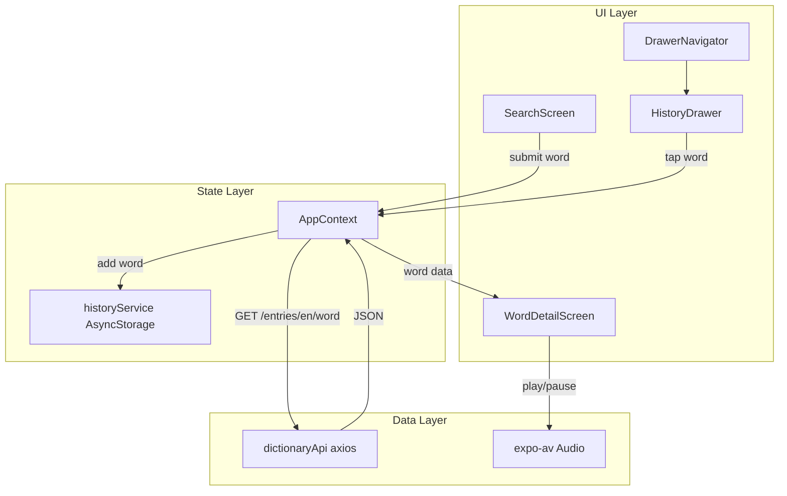
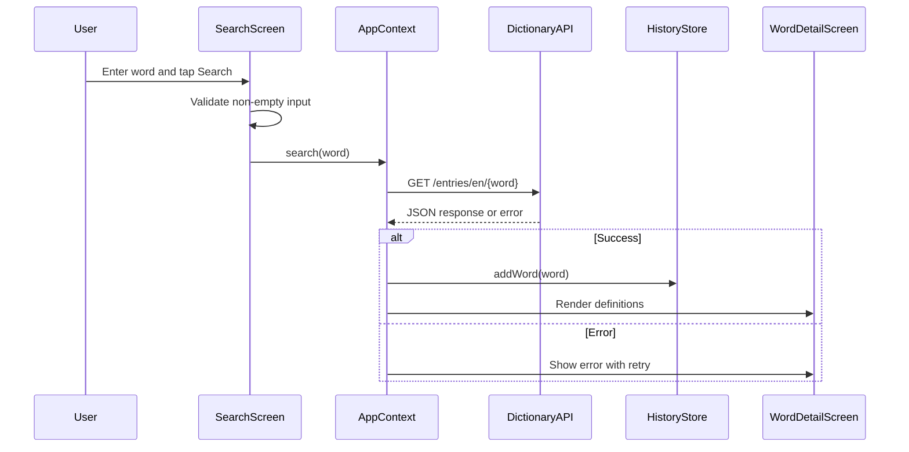

# Dictionary Mobile App — Design Document

## Problem Summary

LexiTech Solutions Ltd needs a cross-platform Dictionary Mobile Application that helps users quickly find English word meanings, pronunciations, and usage examples. The app consumes the Free Dictionary API and must run on Android and iOS with a clean, responsive UI.

## Application Architecture



## Data Flow



## Screens

| Screen | Purpose |
|--------|---------|
| Search | Text input, validation, search button, loading state |
| Word Detail | Word title, phonetics, definitions, examples, audio |
| Drawer (History) | List of previously searched words, tap to re-search |

## API Endpoints

| Method | URL | Purpose |
|--------|-----|---------|
| GET | `https://api.dictionaryapi.dev/api/v2/entries/en/{word}` | Fetch word definitions, phonetics, and examples |

No custom backend is required.

## Error Handling Matrix

| Condition | HTTP / Cause | User Message | Recovery |
|-----------|--------------|--------------|----------|
| Word not found | 404 | Word not found | Retry or return to search |
| Network failure | No response / timeout | Network error. Check your connection. | Retry |
| Malformed response | Invalid JSON shape | Unexpected response message | Retry |
| Empty search | Client validation | Please enter a word before searching. | Enter a word |
| Empty history | No stored items | No searches yet | Search a word |
| Other API errors | 5xx / unknown | Something went wrong. Please try again. | Retry |

## Tech Stack

| Technology | Justification |
|------------|---------------|
| Expo (React Native) | Cross-platform Android/iOS development per assignment requirements |
| TypeScript | Type-safe API models and component props |
| axios | Required HTTP client for API integration |
| React Navigation (Drawer + Stack) | Drawer history menu and screen navigation |
| AsyncStorage | Persistent search history across app restarts |
| expo-av | Audio pronunciation playback from API URLs |

## Folder Structure

```
src/
├── components/     # Reusable UI (SearchBar, ErrorView, audio, history)
├── context/        # Global app state (search, loading, errors, history)
├── navigation/     # Drawer + stack navigators
├── screens/        # Search and Word Detail screens
├── services/       # API and AsyncStorage history
├── theme/          # Colors, spacing, shared styles
├── types/          # Dictionary API TypeScript interfaces
└── utils/          # Safe parsing helpers
```
